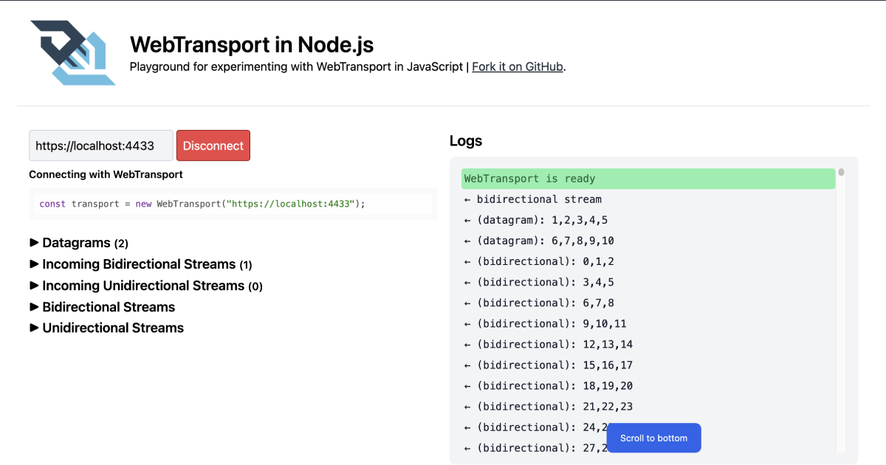

# WebTransport Playground

- Uses [fails-components/webtransport](https://github.com/fails-components/webtransport) as HTTP/3 layer.
- Node.js 20+



## Running locally

Install and run the backend:

```
npm install
npm start
```

_On another terminal_, install and run the frontend:

```
cd client
npm install
npm start
```

Open `https://localhost:4433` in your browser. (Currently only Chrome is capable of connecting)

## Deploying

WIP

https://community.letsencrypt.org/t/nginx-http3-letsencrypt/181112/13

- SSL certificate must be set to expire in less than 14 days.

## License

MIT
